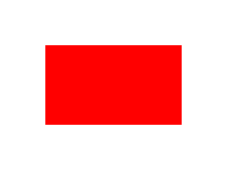
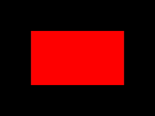

# gooey-canvas

[](https://crates.io/crates/gooey-canvas)
[](https://github.com/khonsulabs/gooey-canvas/actions?query=workflow:Tests)
[](https://khonsulabs.github.io/gooey-canvas/coverage/)
[](https://khonsulabs.github.io/gooey-canvas/main/gooey-canvas/)

This crate provides a `Canvas` widget, allowing 2d-graphics drawing via the [`Renderer`](https://gooey.rs/main/gooey/renderer/trait.Renderer.html) trait.

Standalone:

```rust
Canvas::new(|renderer: CanvasRenderer| {
    renderer.fill_rect::<BackgroundColor>(
        &renderer.bounds().inflate(-64., -64.),
        &Style::default().with(BackgroundColor(Color::new(1., 0., 0., 1.).into())),
    );
})
```

Or as the content of a [`Component`](https://gooey.rs/main/gooey/widgets/component/struct.Component.html):

```rust
builder
    .on_render(|renderer: CanvasRenderer| {
        renderer.fill_rect::<BackgroundColor>(
            &renderer.bounds().inflate(-64., -64.),
            &Style::default().with(BackgroundColor(Color::new(1., 0., 0., 1.).into())),
        );
    })
    .finish()
```

Rendered in light mode (background color of the window shines through the edges):



And dark mode:



## Supported Frontends

Support for each frontend is controlled with feature flags. By default, `frontend-browser` and `frontend-kludgine` are both enabled.

* `frontend-browser`: Enables support for the `gooey-browser` frontend.
* `frontend-kludgine`: Enables support for the `gooey-rasterizer` frontend with the `gooey-kludgine` renderer.

## Why isn't this in `gooey-widgets`?

One of the design philosophies of `Gooey` is to make the cross-platform user-interface code be unaware of the current frontend. To implement this widget, the widget implementation needs to hide the frontend from the user. The only way to do this is to have direct knowldge of all the compatible frontends.

Because this is a powerful widget, we didn't want this widget to be limited to supporting only the frontends supported by the `gooey` crate. Thus, this crate is separate from the main repository because other frontends will need to add support directly to this crate for `Canvas` to work.

Each frontend will be gated behind feature flags.

## About

This is being developed by and for [Khonsu Labs](https://khonsulabs.com/) for [Cosmic Verge](https://github.com/khonsulabs/cosmicverge). I hope it will be useful to others as well.

This code is dual-licensed under the [MIT License](./LICENSE-MIT) and [Apache License 2.0](./LICENSE-APACHE). Fonts in this repository are not included by default, and are [solely licensed under the Apache License 2.0](./fonts/README.md).

[Kludgine]: https://github.com/khonsulabs/kludgine